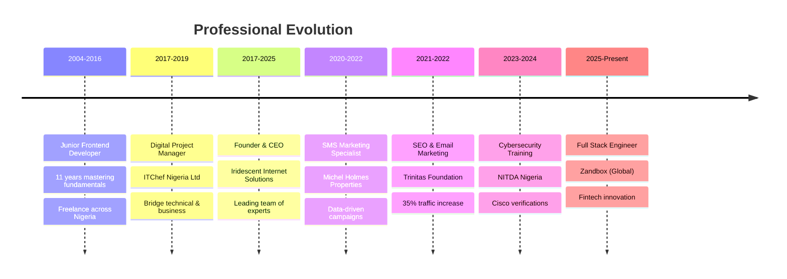

<div id="top"></div>

<div align="">
  <div align="right">

  </div>

<!--   <h3 align="">Hello World</h3>
  <p align="center">
    It's Mr Iridescent!
  </p> -->


  ```javascript
  import { Profile } from "GitHub";
  Profile.set({
    name: "David Akpoviroro Oke (Mr. Iridescent)",
    Passion: "Computers and IT Solutions (X.A.A.S)",
    occupation: "Digital Polymat + Programmer + CyberSecurity Professional + Futurist"
  });
  ```

</div>

<div align="center">


[](https://mriridescent-digitalpolymat.netlify.app)
[](https://www.linkedin.com/in/mriridescent)
[](mailto:mriridescent@yahoo.com)

</div>

## 🧠 Digital Polymat | Deep Thinker | Abstract Conceptualizer | Futurist

> *"In an era of accelerating complexity, the most challenging problems emerge at the intersections of disciplines. The Digital Polymat specializes in these intersections, architecting solutions that transcend traditional boundaries."*

<!-- TABLE OF CONTENTS -->
<details>
  <summary>Table of Contents</summary>
  <ol>
    <li>
      <a href="#about-me">About Me</a>
    </li>
    <li>
      <a href="#skills">Skills</a>
    </li>
    <li><a href="#roadmap">Roadmap</a></li>
    <li><a href="#contact">Contact</a></li>
    <li><a href="#github-analytics">GitHub Analytics</a></li>
    <li><a href="#professional-achievements">Professional Achievements</a></li>
    <li><a href="#featured-projects">Featured Projects</a></li>
  </ol>
</details>

### 🎯 **Current Focus - Digital Nomad & Remote-First Pioneer**
- 🌍 **Remote Full Stack Engineer** at Zandbox (Global) - Building scalable fintech products from anywhere
- 🏢 **Founder & CEO** of Iridescent Internet Solutions (7+ years) - Leading distributed teams across continents
- 🎨 **Creative Director** at Iridescent Creative Studio - Designing for global audiences
- 🛡️ **Cisco Verified** Cyber Threat Manager & Ethical Hacker - Securing remote infrastructures
- 🤖 **AI Engineering Specialist** - Building agentic systems, RAG implementations, and MCP protocols
- 🌐 **Digital Nomad Advocate** - Championing location-independent work and distributed collaboration

---

<!-- ABOUT ME -->
## About Me

I'm a tech lover, researcher/developer of solutions, and programmer. I started coding in 2004. I love to learn new stuff & try them out. :smile:

I'm a **Digital Nomad** and **Remote-First** full-stack web developer who believes in location-independent innovation. Besides being a Linux enthusiast who started from Backtrack 5 - Kali Linux, I work with various Python Libraries, Javascript Libraries, and cutting-edge AI systems from anywhere in the world.

I'm seriously learning **AI Engineering**, **Agentic Systems**, **MCP Protocols**, **RAG implementations**, and emerging technologies like **DevSecOps**, **Web3**, and **Quantum Computing applications**.

My Goal is to build a solid Professional career in the IT sector as a **Digital Polymat** - bridging multiple disciplines to create innovative solutions while championing the **freelance and telecommuting lifestyle** that enables global collaboration and work-life harmony.

## 🌈 **Personality & Cognitive Profile**

```yaml
Cognitive Types: INTP/ENTP/INTJ (NT Temperament)
Enneagram: Type 7 (The Enthusiast)
Work Philosophy: Digital Nomad & Remote-First Pioneer
Core Traits:
  - Deep Thinker & Abstract Conceptualizer
  - Futurist with Renaissance Mindset
  - Intersection Specialist
  - Systems Thinking Advocate
  - Location-Independent Innovation Leader
  - Distributed Team Collaboration Expert
  - Freelance & Telecommuting Psychology Champion
```

---

### Skills

**I'm mostly familiar with:**

&nbsp;
&nbsp;
&nbsp;
&nbsp;
&nbsp;
&nbsp;
&nbsp;
&nbsp;
&nbsp;
&nbsp;
&nbsp;
&nbsp;
&nbsp;
&nbsp;
&nbsp;
&nbsp;
&nbsp;
&nbsp;


&nbsp;
&nbsp;
&nbsp;
&nbsp;
&nbsp;
&nbsp;
&nbsp;
&nbsp;
&nbsp;
&nbsp;
&nbsp;
&nbsp;
&nbsp;
&nbsp;
&nbsp;
&nbsp;
&nbsp;
&nbsp;
&nbsp;
&nbsp;
&nbsp;

**🤖 AI Engineering & Agentic Systems:**

&nbsp;
&nbsp;
&nbsp;
&nbsp;
&nbsp;
&nbsp;
&nbsp;
&nbsp;

**🔒 DevSecOps & Security:**

&nbsp;
&nbsp;
&nbsp;
&nbsp;
&nbsp;
&nbsp;
&nbsp;

**🌐 Web3 & Blockchain:**

&nbsp;
&nbsp;
&nbsp;
&nbsp;
&nbsp;

**🏦 FinTech & Automation:**

&nbsp;
&nbsp;
&nbsp;
&nbsp;
&nbsp;

**🌍 Digital Nomad & Remote-First Tools:**

&nbsp;
&nbsp;
&nbsp;
&nbsp;
&nbsp;
&nbsp;
&nbsp;

<p align="right">(<a href="#top">back to top</a>)</p>

## Roadmap

- [x] Cisco CyberOps Associate(Cisco Verified)
- [x] Graphic Designs
- [x] Essential Web development
- [x] UI / UX
- [x] Dig more in SPA
- [x] LAMP Stack
- [x] MERN Stack
- [x] MEAN Stack
- [x] DevOps
- [x] Java Programming, Swing/JavaFx e.t.c
- [x] Python Programming
- [x] Ethical Hacking (Cisco Verified)
- [x] End-Point Security (Cisco Verified)
- [x] Cyber Threat Management (CTM) (Cisco Verified)
- [ ] Cisco DevNet
- [x] React Native
- [x] React / Next.JS / Typescript
- [ ] Native app development
    - [ ] Kotlin
    - [ ] Swift
    - [ ] Flutter
- [x] Data Structures and Algorithm
- [x] Web Application Security
- [x] DevSecOps Implementation & Security Automation
- [x] AI Engineering & Machine Learning Operations
- [x] Agentic AI Systems & Multi-Agent Frameworks
- [x] RAG (Retrieval-Augmented Generation) Systems
- [x] MCP (Model Context Protocol) Implementation
- [x] Vector Databases & Semantic Search
- [x] LangChain & AI Orchestration Frameworks
- [ ] Advanced Prompt Engineering & AI Safety
- [ ] Quantum Machine Learning Applications
- [ ] Brain-Computer Interface Development
- [ ] Quantum Computing Applications
- [ ] DNA Data Storage Systems
- [ ] Neuromorphic Computing
- [ ] Molecular Information Processing
- [ ] Digital Nomad Community Building
- [ ] Remote Team Leadership Certification
- [ ] Global Freelance Network Development

<p align="right">(<a href="#top">back to top</a>)</p>

---

## 📊 **GitHub Analytics**

<div align="center">


</div>

---

## 🏆 **Professional Achievements**

### **🎯 Impact Metrics**
- 📈 **35% SEO Traffic Increase** at Trinitas Foundation
- 🚀 **7+ Years** Leading Digital Innovation
- 🏢 **Founded** Iridescent Internet Solutions (2017)
- 🌍 **Global Remote Work** at Zandbox / Freelance
- 🛡️ **4 Cisco Verifications** in Cybersecurity
- 🤖 **AI Engineering** - RAG Systems, Agentic AI, MCP Protocols
- 🔒 **DevSecOps** - Security-First Development & Automation
- 🌐 **Digital Nomad** - 5+ Years Location-Independent Work

### **🎓 Certifications & Training**
- 🔐 **Cisco Verified Cyber Threat Management (CyberTM)** - NITDA Nigeria
- 🕵️ **Cisco Verified Ethical Hacker** - NITDA Nigeria  
- 🛡️ **Cisco Verified Endpoint Security Engineer** - NITDA Nigeria
- 🔍 **Cisco Verified CyberOps Associate** - Cisco Networking Academy
- 💻 **A+ & N+ Certified** - New Horizons
- 🎨 **Creative Design & Web Development** - Afrihub GDLI

---

## 🌟 **Featured Projects**

### 🏦 **Fintech Dashboard Platform** (Zandbox)
- **Tech Stack**: React.js, Spring Boot, Microservices
- **Impact**: Scalable financial products for global markets
- **Role**: Full Stack Engineer (Remote)

### 🌐 **Digital Product Ecosystem** (Iridescent Internet Solutions)
- **Tech Stack**: MERN/LAMP Stack, WordPress, Mobile Apps
- **Impact**: End-to-end digital solutions for startups to enterprises
- **Role**: Founder & Digital Product Architect

### 🤖 **AI Engineering & Agentic Systems**
- **Tech Stack**: LangChain, OpenAI, Anthropic, Vector Databases, RAG
- **Specialization**: Multi-agent systems, MCP protocols, semantic search
- **Impact**: Building intelligent automation for remote-first organizations

### 🔒 **DevSecOps & Security Automation**
- **Tech Stack**: SAST/DAST tools, OWASP, Snyk, SonarQube, Security Pipelines
- **Specialization**: Threat Management, Ethical Hacking, Endpoint Security
- **Training**: Extensive NITDA Nigeria cybersecurity programs
- **Approach**: Security-first development with automated vulnerability scanning

### 🌍 **Digital Nomad Infrastructure Solutions**
- **Focus**: Remote team collaboration, distributed system security
- **Tools**: VPN architectures, secure communication channels, global CDN optimization
- **Impact**: Enabling seamless location-independent work for global teams

---

## 🧬 **The Polymathic Approach**

### **🎨 Da Vincian Principles in Code**
1. **Curiosità** - Insatiable curiosity for emerging technologies
2. **Dimostrazione** - Proof through execution and real-world testing
3. **Sensazione** - Refined sensitivity to user experience and system patterns
4. **Sfumato** - Embracing ambiguity in complex problem spaces
5. **Arte/Scienza** - Balancing analytical precision with creative innovation
6. **Corporalità** - Mental agility across multiple technology domains
7. **Connessione** - Systems thinking and interdisciplinary synthesis

### **🔮 Current Learning Focus**
- 🧠 Brain-Computer Interface Development
- 🌌 Quantum Computing Applications
- 🧬 DNA Data Storage Systems
- 🤖 Neuromorphic Computing
- 🔬 Molecular Information Processing

---

## 📈 **Professional Timeline**



---

## 🤝 **Let's Connect & Collaborate**

<div align="center">

### 🌟 **Open to Opportunities In:**
🚀 **Fintech Innovation** | 🛡️ **Cybersecurity Solutions** | 🤖 **AI/ML Projects** | 🌐 **Web3 Development** | 📱 **Mobile Applications**

## Contact

Feel free to contact me.

### ***Personal***

[](https://facebook.com/iammriridescent)&nbsp;
[](https://instagram.com/mriridescent)&nbsp;

### ***Professional***

[](https://mriridescent-digitalpolymat.netlify.app)
[](https://www.linkedin.com/in/mriridescent)
[](mailto:mriridescent@yahoo.com)

<p align="right">(<a href="#top">back to top</a>)</p>

---

<div align="center">

*"The future belongs to those who can navigate complexity with wisdom, synthesize knowledge across domains, and create solutions that honor both technical excellence and human values."*

**🌟 Join the Digital Polymat Movement | Embrace the Intersection | Transcend the Boundaries 🌟**

</div>
