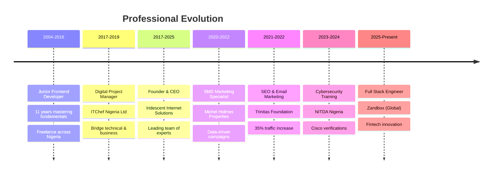

<div id="top"></div>

<div align="">
  <div align="right">

  </div>

<!--   <h3 align="">Hello World</h3>
  <p align="center">
    It's Mr Iridescent!
  </p> -->


  ```javascript
import { Profile } from "GitHub";
  Profile.set({
    name: "David Akpoviroro Oke (Mr. Iridescent)",
    Passion: "Computers and IT Solutions (X.A.A.S)",
    occupation: "Digital Polymat + Programmer + CyberSecurity Professional + Futurist"
  });
```

</div>

<div align="center">


[](https://mriridescent-digitalpolymat.netlify.app)
[](https://www.linkedin.com/in/mriridescent)
[](mailto:mriridescent@yahoo.com)

</div>

## 🧠 Digital Polymat | Deep Thinker | Abstract Conceptualizer | Futurist

> *"In an era of accelerating complexity, the most challenging problems emerge at the intersections of disciplines. The Digital Polymat specializes in these intersections, architecting solutions that transcend traditional boundaries."*

<!-- TABLE OF CONTENTS -->
<details>
  <summary>Table of Contents</summary>
  <ol>
    <li>
      <a href="#about-me">About Me</a>
    </li>
    <li>
      <a href="#skills">Skills</a>
    </li>
    <li><a href="#roadmap">Roadmap</a></li>
    <li><a href="#contact">Contact</a></li>
    <li><a href="#github-analytics">GitHub Analytics</a></li>
    <li><a href="#professional-achievements">Professional Achievements</a></li>
    <li><a href="#featured-projects">Featured Projects</a></li>
  </ol>
</details>

### 🎯 **Current Focus**
- 🚀 **Full Stack Engineer** at Zandbox (Global) - Building scalable fintech products
- 🏢 **Founder & CEO** of Iridescent Internet Solutions (7+ years)
- 🎨 **Creative Director** at Iridescent Creative Studio
- 🛡️ **Cisco Verified** Cyber Threat Manager & Ethical Hacker

---

<!-- ABOUT ME -->
## About Me

I'm a tech lover, researcher/developer of solutions, and programmer. I started coding in 2004. I love to learn new stuff & try them out. :smile:

I'm a full-stack web developer. Besides, I'm a Linux enthusiast who started from Backtrack 5 - Kali Linux and love working with various Python Libraries and Javascript Libraries.

I'm seriously learning app development, kotlin, swift, react, react-native, etc.

My Goal is to build a solid Professional career in the IT sector as a **Digital Polymat** - bridging multiple disciplines to create innovative solutions.

## 🌈 **Personality & Cognitive Profile**

```yaml
Cognitive Types: INTP/ENTP/INTJ (NT Temperament)
Enneagram: Type 7 (The Enthusiast)
Core Traits:
  - Deep Thinker & Abstract Conceptualizer
  - Futurist with Renaissance Mindset
  - Intersection Specialist
  - Systems Thinking Advocate
```

---

### Skills

**I'm mostly familiar with:**

&nbsp;
&nbsp;
&nbsp;
&nbsp;
&nbsp;
&nbsp;
&nbsp;
&nbsp;
&nbsp;
&nbsp;
&nbsp;
&nbsp;
&nbsp;
&nbsp;
&nbsp;
&nbsp;
&nbsp;
&nbsp;


&nbsp;
&nbsp;
&nbsp;
&nbsp;
&nbsp;
&nbsp;
&nbsp;
&nbsp;
&nbsp;
&nbsp;
&nbsp;
&nbsp;
&nbsp;
&nbsp;
&nbsp;
&nbsp;
&nbsp;
&nbsp;
&nbsp;
&nbsp;
&nbsp;

<p align="right">(<a href="#top">back to top</a>)</p>

## Roadmap

- [x] Cisco CyberOps Associate(Cisco Verified)
- [x] Graphic Designs
- [x] Essential Web development
- [x] UI / UX
- [x] Dig more in SPA
- [x] LAMP Stack
- [x] MERN Stack
- [x] MEAN Stack
- [x] DevOps
- [x] Java Programming, Swing/JavaFx e.t.c
- [x] Python Programming
- [x] Ethical Hacking (Cisco Verified)
- [x] End-Point Security (Cisco Verified)
- [x] Cyber Threat Management (CTM) (Cisco Verified)
- [ ] Cisco DevNet
- [x] React Native
- [x] React / Next.JS / Typescript
- [ ] Native app development
    - [ ] Kotlin
    - [ ] Swift
    - [ ] Flutter
- [x] Data Structures and Algorithm
- [x] Web Application Security
- [ ] Learn more about microcontroller programming
- [ ] Learn more about artificial intelligence
- [ ] Brain-Computer Interface Development
- [ ] Quantum Computing Applications
- [ ] DNA Data Storage Systems
- [ ] Neuromorphic Computing
- [ ] Molecular Information Processing

<p align="right">(<a href="#top">back to top</a>)</p>

---

## 📊 **GitHub Analytics**

<div align="center">


</div>

---

## 🏆 **Professional Achievements**

### **🎯 Impact Metrics**
- 📈 **35% SEO Traffic Increase** at Trinitas Foundation
- 🚀 **7+ Years** Leading Digital Innovation
- 🏢 **Founded** Iridescent Internet Solutions (2017)
- 🌍 **Global Remote Work** at Zandbox
- 🛡️ **8+ Cisco Verifications** in Cybersecurity

### **🎓 Certifications & Training**
- 🔐 **Cisco Cyber Threat Management (CyberTM)** - NITDA Nigeria
- 🕵️ **Cisco Verified Ethical Hacker** - NITDA Nigeria  
- 🛡️ **Cisco Endpoint Security Engineer** - NITDA Nigeria
- 🔍 **Cisco CyberOps Associate** - Cisco Networking Academy
- 💻 **A+ & N+ Certified** - New Horizons
- 🎨 **Creative Design & Web Development** - Afrihub GDLI

---

## 🌟 **Featured Projects**

### 🏦 **Fintech Dashboard Platform** (Zandbox)
- **Tech Stack**: React.js, Spring Boot, Microservices
- **Impact**: Scalable financial products for global markets
- **Role**: Full Stack Engineer (Remote)

### 🌐 **Digital Product Ecosystem** (Iridescent Internet Solutions)
- **Tech Stack**: MERN/LAMP Stack, WordPress, Mobile Apps
- **Impact**: End-to-end digital solutions for startups to enterprises
- **Role**: Founder & Digital Product Architect

### 🔒 **Cybersecurity Consulting**
- **Specialization**: Threat Management, Ethical Hacking, Endpoint Security
- **Training**: Extensive NITDA Nigeria cybersecurity programs
- **Approach**: Security-first development methodology

---

## 🧬 **The Polymathic Approach**

### **🎨 Da Vincian Principles in Code**
1. **Curiosità** - Insatiable curiosity for emerging technologies
2. **Dimostrazione** - Proof through execution and real-world testing
3. **Sensazione** - Refined sensitivity to user experience and system patterns
4. **Sfumato** - Embracing ambiguity in complex problem spaces
5. **Arte/Scienza** - Balancing analytical precision with creative innovation
6. **Corporalità** - Mental agility across multiple technology domains
7. **Connessione** - Systems thinking and interdisciplinary synthesis

### **🔮 Current Learning Focus**
- 🧠 Brain-Computer Interface Development
- 🌌 Quantum Computing Applications
- 🧬 DNA Data Storage Systems
- 🤖 Neuromorphic Computing
- 🔬 Molecular Information Processing

---

## 📈 **Professional Timeline**



---

## 🤝 **Let's Connect & Collaborate**

<div align="center">

### 🌟 **Open to Opportunities In:**
🚀 **Fintech Innovation** | 🛡️ **Cybersecurity Solutions** | 🤖 **AI/ML Projects** | 🌐 **Web3 Development** | 📱 **Mobile Applications**

### 📫 **Reach Out:**
[](https://mriridescent-digitalpolymat.netlify.app)
[](https://www.linkedin.com/in/mriridescent)
[](mailto:mriridescent@yahoo.com)

---

*"The future belongs to those who can navigate complexity with wisdom, synthesize knowledge across domains, and create solutions that honor both technical excellence and human values."*

**🌟 Join the Digital Polymat Movement | Embrace the Intersection | Transcend the Boundaries 🌟**

</div>
 Ltd
              : Bridge technical & business
    2017-2025 : Founder & CEO
              : Iridescent Internet Solutions
              : Leading team of experts
    2020-2022 : SMS Marketing Specialist
              : Michel Holmes Properties
              : Data-driven campaigns
    2021-2022 : SEO & Email Marketing
              : Trinitas Foundation
              : 35% traffic increase
    2023-2024 : Cybersecurity Training
              : NITDA Nigeria
              : Cisco verifications
    2025-Present : Full Stack Engineer
                 : Zandbox (Global)
                 : Fintech innovation
```

---

## 🤝 **Let's Connect & Collaborate**

<div align="center">

### 🌟 **Open to Opportunities In:**
🚀 **Fintech Innovation** | 🛡️ **Cybersecurity Solutions** | 🤖 **AI/ML Projects** | 🌐 **Web3 Development** | 📱 **Mobile Applications**

### 📫 **Reach Out:**
[](https://mriridescent-digitalpolymat.netlify.app)
[](https://www.linkedin.com/in/mriridescent)
[](mailto:mriridescent@yahoo.com)

---

*"The future belongs to those who can navigate complexity with wisdom, synthesize knowledge across domains, and create solutions that honor both technical excellence and human values."*

**🌟 Join the Digital Polymat Movement | Embrace the Intersection | Transcend the Boundaries 🌟**

</div>
